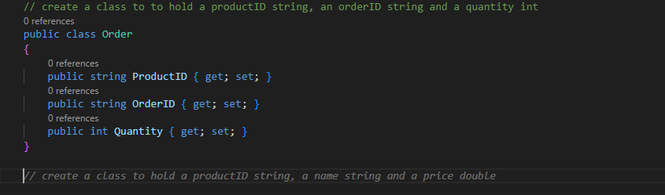
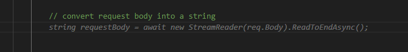
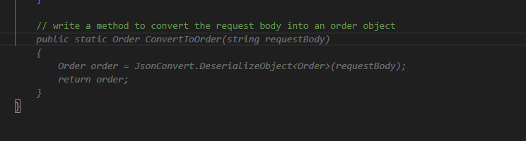
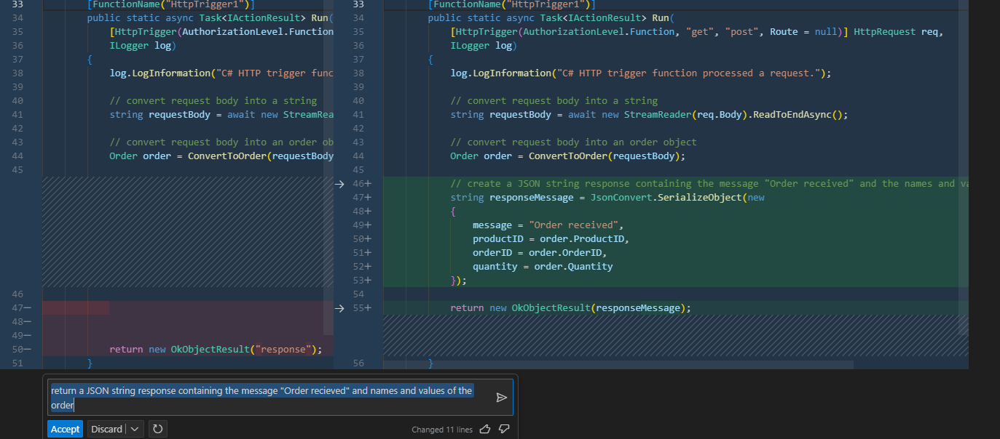
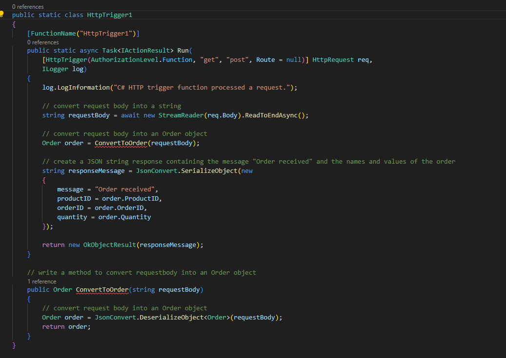
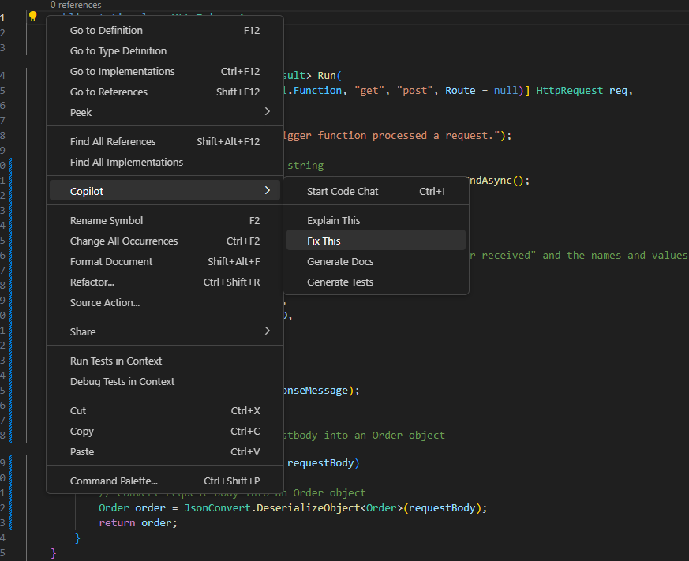
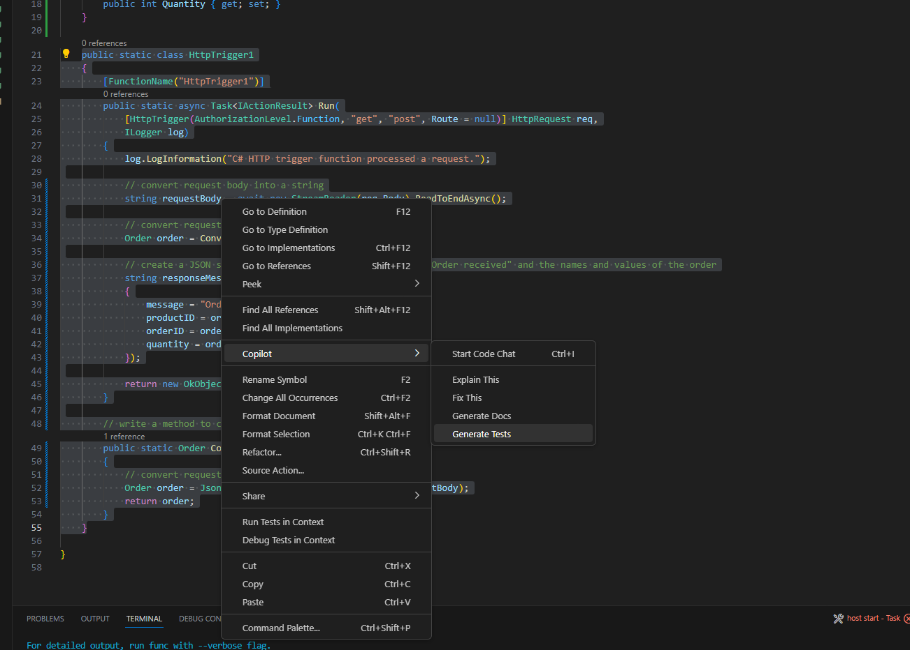
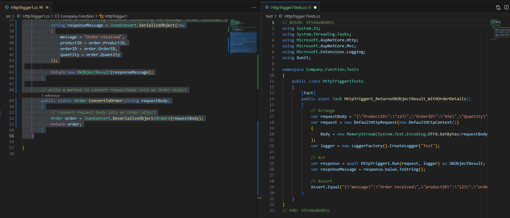
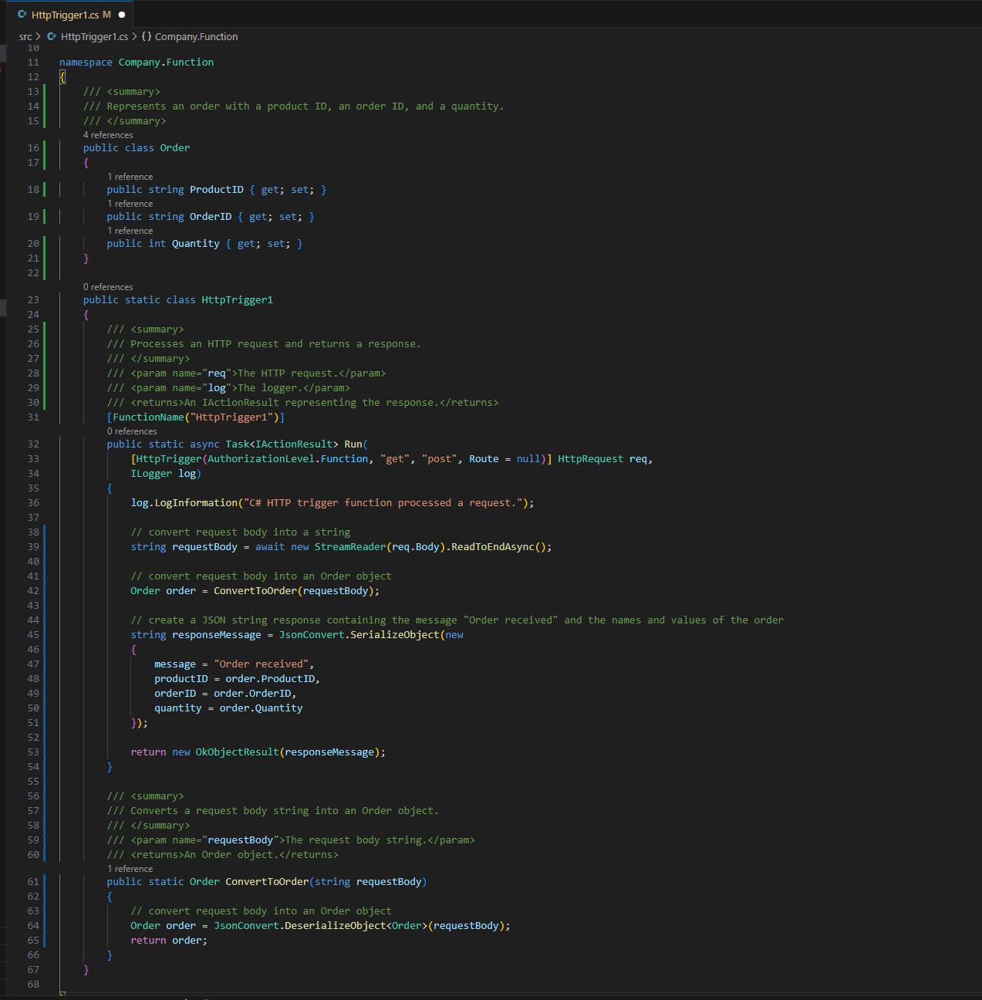
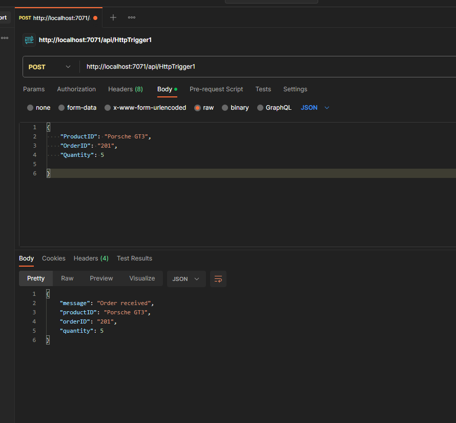

# MTC Github Copilot Strategy Briefing / Demo

This content guides a presenter through an approximately two hour strategy briefing on Github Copilot delivered in a 1-1 or 1-few context.

## Content Overview
- [Sample Agenda](./resources/agenda-mtc-1m.docx)
- [Copilot Pitch Deck](./resources/GitHub-Copilot-Pitch-Deck-Final.pptx)
- [MTC App Innovation Copilot offerings](./resources/MTC%20GHCopilot%20Offering.pptx)

## About the Briefing / Demo 

The workshop provides the audiences with an overview of the Github Copilot service and a brief live demo of it's features and functionality.

**Audience**: C-Level Executives, IT Leadership, Business Decision Makers

| Time         | Topic   |
|:-------------|:------- |
|9:00 AM  | Introductions and Objectives, MTC Overview|
|9:15 AM  | Copilot Feature Overview |
|9:45 AM  | Copilot Demo |
|10:15 AM | Q/A |
|11:00 AM | Wrap and Next Steps |

## Copilot Demo Walkthrough
Assume we're tasked with creating a REST API that takes in an order for our product, prepares it for additional processing such as db persistence, etc, then responds to the caller with a valid response.  Using Copilot:
* Code completion
* Test case generation
* Code documentation

We'll implement a REST handler, serialize the payload into an object, respond to the caller with valid response, write test cases and document the fuctionality as well as use Copilot to fix any problems along the way.

### 1. Create the required functionality using code completion

Beginning with the stubbed class for an HTTP trigger function.  Using an inline comment, prompt Copilot to generate an Order class containing the relevant fields for our order object:

        // create a class to hold a productID string, an orderID string and a quantity int

Copilot creates an Order class:

Convert the incoming request body to a string:

    // convert request body into a string

Create a method that deserializes the request string into our Order object:

    // write a method to convert the request body into an order object

Use the new method to convert the payload:

    // convert request body into an order object

Return an Order Recieved message to the caller containing the original payload, this time using Copilot Chat companion:

Assume that a change was introduced to the code that boke its functionality.  Fix this by highlighting the code, through the Copilot conext menu, choose Fix:

### 2. Generate test case using test case generation

Again using the Copilot context menu, highlight the target code and choose Generate Tests:

A test class is generated:

### 3. Document the class using documentation generation

Using the Copilot context menu, highlight the target code and choose Generate Docs:

Documentation is created:

### 4. Optionally test the code to demonstrate end-to-end functionality

## Contributing

This project welcomes contributions and suggestions.  Most contributions require you to agree to a
Contributor License Agreement (CLA) declaring that you have the right to, and actually do, grant us
the rights to use your contribution. For details, visit https://cla.opensource.microsoft.com.

When you submit a pull request, a CLA bot will automatically determine whether you need to provide
a CLA and decorate the PR appropriately (e.g., status check, comment). Simply follow the instructions
provided by the bot. You will only need to do this once across all repos using our CLA.

This project has adopted the [Microsoft Open Source Code of Conduct](https://opensource.microsoft.com/codeofconduct/).
For more information see the [Code of Conduct FAQ](https://opensource.microsoft.com/codeofconduct/faq/) or
contact [opencode@microsoft.com](mailto:opencode@microsoft.com) with any additional questions or comments.

## Trademarks

This project may contain trademarks or logos for projects, products, or services. Authorized use of Microsoft 
trademarks or logos is subject to and must follow 
[Microsoft's Trademark & Brand Guidelines](https://www.microsoft.com/en-us/legal/intellectualproperty/trademarks/usage/general).
Use of Microsoft trademarks or logos in modified versions of this project must not cause confusion or imply Microsoft sponsorship.
Any use of third-party trademarks or logos are subject to those third-party's policies.
