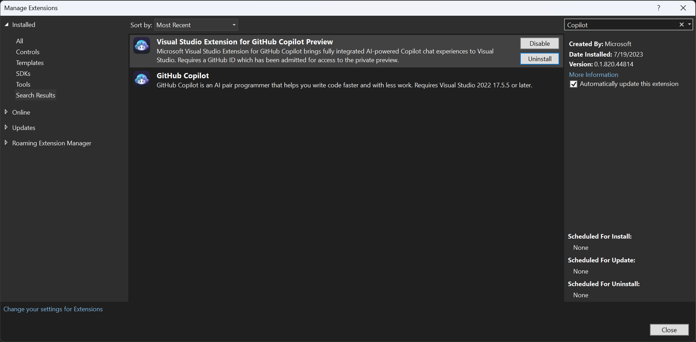
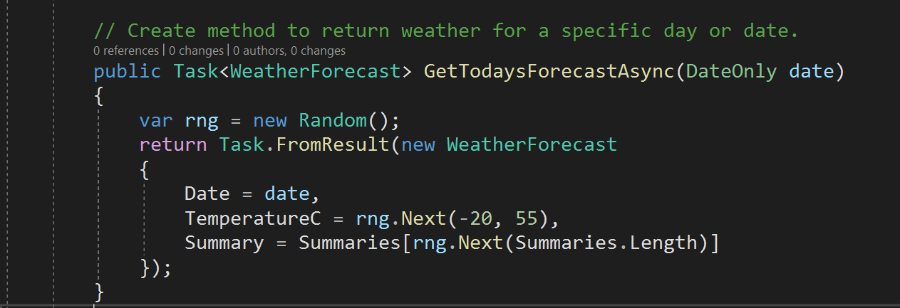
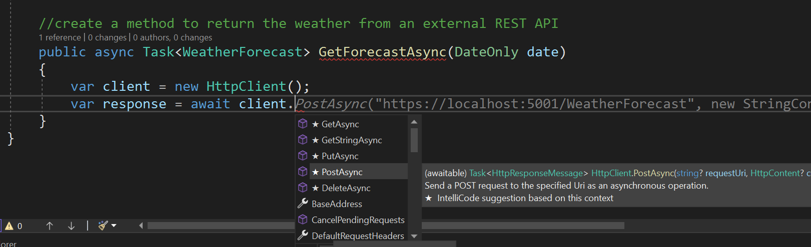

# Visual Studio with GitHub Copilot Demo

In this scenario, you are tasked with creating a new Blazor application. You have a few ideas of what you want to do, but you're not sure how to get started. You've heard about GitHub Copilot, and you want to see if it can help you get started.

## Pre-requisites
Before getting started with the demo, you need the following items
- Visual Studio 2022
- [GitHub Copilot extension for Visual Studio](https://learn.microsoft.com/en-us/visualstudio/ide/visual-studio-github-copilot-extension?view=vs-2022)
- [Visual Studio Extension for GitHub Copilot](https://marketplace.visualstudio.com/items?itemName=VisualStudioExptTeam.VSGitHubCopilot)
- EXP MSDN Developer Account for your MTC
    - use this account for signing into both of the Copilot extensions
    - find your persona [here](https://expeople.onemtc.net)

Here is an image of the manage extension window in Visual Studio showing the 2 Copilot extensions.

 

## Demo Walkthrough
Here is a suggested path to show off GitHub Copilot. This is not a script, but how you might show the features available in GitHub Copilot. Feel free to deviate from this path and make it your own.

### List of key features to show in Visual Studio
Here is the current list of capabilities to show for GitHhub Copilot and Copilot Chat.  This list will be updated as new features are added.

<ins>GitHub Copilot<ins> 
- generate code from a comment
- generate code from a selection in Intellisense

<ins>GitHub Copilot Chat<ins>
- generate test code through Alt + / shortcut (A+*I*)
- describe what a class or method does.
- generate Blazor component from a chat message.

### Suggested path

**Code from Comment** - Begin with the WeatherForecastService class.  Add a comment to describe a method that returns the weather for a specific day or date.  

For example:
    
    // Create method to return weather for a specific day or date.

Press Enter and see the suggestions from GitHub Copilot.  Here is an example of what can be generated.



**Code from Intellisense** - Your service can also call out to an external API to get the weather.  There is a stub for this method in the WeatherForecastService class. You need to load the response object from the HttpClient GetAsync method.

As you write the code, show interaction between GitHub Copilot and Intellisense feature, by pausing after typing client. to display the Intellisense.  See this blog post for background on the Intellisense feature: [Visual Studio’s IntelliSense list can now steer GitHub Copilot code completions.](https://devblogs.microsoft.com/visualstudio/github-copilot-visual-studio-intellisense/)

Show how changing the selection in the Intellisense generates different code from GitHub Copilot.

Pressing the Ctrl key will hide the intellisense window to show any hidden code suggested by Copilot.



**Describe the WeatherForecastService Class** - Highlight the WeatherForecastService class and press Alt + / to show the GitHub Copilot Chat window.  Type 'describe the class and press enter.  Copilot will generate a text walkthrough of what the class does.

**Unit Tests From Chat** - Highlight the WeatherForecastService class and press Alt + / to show the GitHub Copilot Chat window.  Type 'create unit tests' and press enter.  Copilot will generate a unit test class for the WeatherForecastService class.  Here is an example of what can be generated.

```
using Xunit;

namespace BlazorApp.Data.Tests 
{
    
    
    public class WeatherForecastServiceTests
    {

[Fact]
public void GetForecastAsync_ReturnsFiveItems()
{
    // Arrange
    var service = new WeatherForecastService();
    var today = new DateOnly(2021, 10, 1);

    // Act
    var result = await service.GetForecastAsync(today);

    // Assert
    Assert.Equal(5, result.Length);
}

[Fact]
public void GetForecastFromApiAsync_ReturnsWeatherForecast()
{
    // Arrange
    var service = new WeatherForecastService();
    var today = new DateOnly(2021, 10, 1);

    // Act
    var result = await service.GetForecastFromApiAsync(today);

    // Assert
    Assert.IsType<WeatherForecast>(result);
}

} // End of WeatherForecastServiceTests class
} // End of BlazorApp.Data.Tests namespace
```

**Blazor Component From Chat** - This one can be a little challenging and represents a complex ask but it is always good to show and talk through the results.

Open the FetchData.razor page.  Select the contents of the page and press Alt + / to show the GitHub Copilot Chat window.  Type the following text, or your own version of this, then press enter.

```
generate a blazor component that displays the weather for each day as a card with the date, day of the week, temperature and an image that changes based on the values in the summary field.  Also include the razor code to display this on the FetchData page.
```

Example of the code generated by Copilot:
```
@using BlazorApp.Data

<div class="card">
    <div class="card-header">
        <h3>@WeekDay(forecast.Date)</h3>
        <p>@forecast.Date.ToShortDateString()</p>
    </div>
    <div class="card-body">
        
        <p>@forecast.Summary</p>
        <p>
            <span class="temp-c">@forecast.TemperatureC °C</span>
            <span class="temp-f">@forecast.TemperatureF°F</span>
        </p>
    </div>
</div>

@code {
    [Parameter] public WeatherForecast forecast { get; set; }

    private string GetImageUrl(string summary)
    {
        return summary switch
        {
            "Freezing" => "url-to-image1",
            "Bracing" => "url-to-image2",
            "Chilly" => "url-to-image3",
            "Cool" => "url-to-image4",
            "Mild" => "url-to-image5",
            "Warm" => "url-to-image6",
            "Balmy" => "url-to-image7",
            "Hot" => "url-to-image8",
            "Sweltering" => "url-to-image9",
            "Scorching" => "url-to-image10",
            _ => "default-url-to-image"
        };
    }

    private string WeekDay(DateTime date)
    {
        return date.DayOfWeek.ToString();
    }
}
``` 

Paste this code into the existing WeatherCard.razor component.  The FetchData.razor page already has a connection to this component.  Uncomment it and confirm the properties in the component and the razor page all match up.  Run the application to see the results.